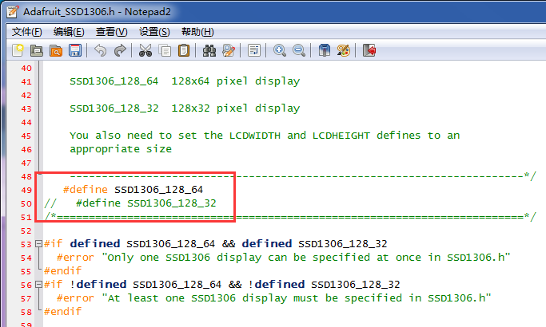
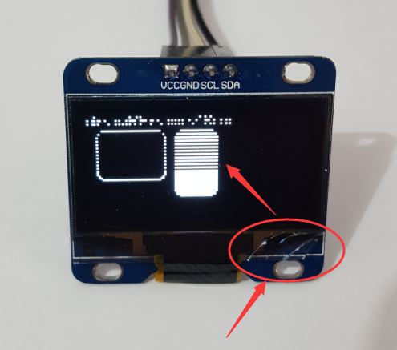

# How to use OLED model in Arduino

Demo with Arduino UNO

0.96 inch use SSD1306 driver chip, it's include I2C or SPI interface, and internal charge-pump.

## Step 1: Connect OLED display to Arduino:
- VCC --> 3.3v or 5v
- GND --> GND
- SCL --> A5
- SDA --> A4

## Step 2: Install this library
- Copy "Adafruit_SSD1306" and "Adafruit_GFX" this two folder into "X:\Documents\Arduino\libraries".

- In order to reduce the pin number, we use a hardware RESET system. Before init OLED device, delay more than 10ms is must needed.

- The standard library form Adafruit or u8glib may not very suitable for our OLED devices. Make sure you are using our provided libraries(we changed the I2C address and #define SSD1306_128_64 in Adafruit_SSD1306.h). If those files already in you libraries, replace it.

## Step 3: Run demo in file "Adafruit_SSD1306\examples" and download into Arduino
Now, if without anyproblem, the OLED will run.

## Issue/Bug report template
Before reporting an issue, make sure you've searched for similar one that was already created. [Click here](https://github.com/Heltec-Aaron-Lee/heltec0.96OLED/issues).

# Summary of common problems

## Can't light up the OLED display?

- Please check the follow issue:
- Check the connection between OLED and Arduino;
- Make sure you are using out provided libraries;
- The default I2C/IIC address of the display should be 0x3C. We printed in model is 0x78 or 0x7A, but for AVR or MSP430 series (Arduino based on AVR), the IIC/I2C buffer is 7-bits, so, we should right shift 1-bit while using in Arduino or MSP430.(0x3c = 0X78 >> 1)
- Check the VCC and GND pins is right be connected, never connect VCC to GND and GND to VCC, it will broke model less than a second.
- Wipe the tin Solder part with alcohol.

## The dot matrix is 128*32?
We never produced any 0.96 or 1.3 inch with 128*32 dot matrix. Open "Adafruit_SSD1306.h" and make sure the "#define SSD1306_128_64" is available. Like this:

## Lack some lines
It caused by glass broken. The glass of OLED is very fragile, please be careful while using it. This problem outside the maintenance.

